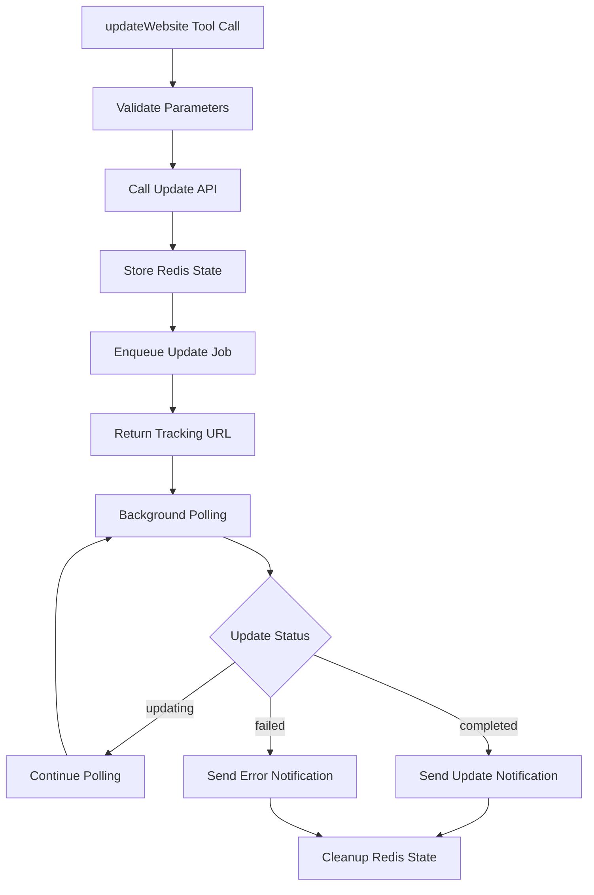

# 🔄 Website Update System - Complete Implementation

## 📋 Overview

The Website Update System enables modification of existing websites created with `webs.clapps.io` using the same Redis-based infrastructure as website generation. Updates preserve the original `projectId` and URL while applying incremental changes with seed consistency.

## 🏗️ Architecture

### **Unified Website Management**
- **Same Infrastructure**: Reuses `webGeneratorWorker.js` for both generate and update operations
- **Redis Integration**: Same queue system with update type differentiation
- **Seed Consistency**: Original seed preserved for reproducible updates
- **URL Preservation**: Same `projectId` and URL maintained across updates

### **Enhanced Tool Integration**
- **AI-Managed Discovery**: AI handles projectId identification from conversation history
- **Seed Management**: AI provides original seed for consistency
- **Template Flexibility**: Optional template changes during updates
- **Dual Messaging**: Success/failure notifications via appropriate service

## 🔧 Components Enhanced

### **1. webGeneratorService.js - Update Methods**
**New Methods Added:**
- **`generateWebsiteSeed()`**: Generates cryptographic random seeds for reproducibility
- **`callUpdateAPI()`**: Handles `/api/update-site` endpoint integration
- **`initiateUpdate()`**: Sets up Redis state and enqueueing for update jobs
- **Enhanced `callGenerationAPI()`**: Now includes seed generation and storage

### **2. webGeneratorWorker.js - Update Support**
**Enhanced Features:**
- **Job Type Detection**: Differentiates between 'generate' and 'update' jobs
- **Update Notifications**: Different messages for creation vs modification
- **Enhanced Redis State**: Includes `jobType`, `originalProjectId`, `seedUsed` fields
- **Timeout Messages**: Update-specific timeout and error messages

### **3. OpenAI Tool Integration**
**New Tool Case**: `updateWebsite` in `openaiIntegration.js`
- **Parameter Validation**: projectId format, updatePrompt length, seed presence
- **Immediate Messaging**: `messageToUser` support for update notifications  
- **Enhanced Response**: Includes `original_project_id`, `update_type`, `seed_used`
- **Error Handling**: Update-specific error messages and validation

## 🚀 updateWebsite Tool Definition

### **OpenAI Tool Specification - FINAL ALIGNED**
```json
{
  "name": "updateWebsite",
  "description": "Actualiza un sitio web con mejoras de diseño, contenido o funcionalidad, manteniendo la URL original y la coherencia por seed.",
  "strict": true,
  "parameters": {
    "type": "object",
    "properties": {
      "project_id": {
        "type": "string",
        "pattern": "^site-[a-z0-9]{8}$",
        "description": "ID único del sitio web a actualizar, obtenido de una generación anterior (formato: site-abc12345)."
      },
      "update_prompt": {
        "type": "string",
        "minLength": 10,
        "maxLength": 5000,
        "description": "Descripción detallada y específica sobre los cambios y mejoras potentes a realizar en el sitio web. Ejemplo: 'rediseñar completamente el home usando nuevas tendencias visuales', 'agregar integración con WhatsApp', etc."
      },
      "seed": {
        "type": "string",
        "pattern": "^[a-f0-9]{32}$",
        "description": "Seed original de 32 caracteres hexadecimales que asegura la coherencia y consistencia visual de la actualización. Utilizar la MISMA que se utilizo siempre para este site ID, salvo que el usuario te pida algo mas variado."
      },
      "template": {
        "type": "integer",
        "enum": [1, 2, 3, 4, 5],
        "description": "ID del nuevo template opcional para el sitio: 1=TechFlow, 2=MinimalZen, 3=NeonVibe, 4=CorporatePro, 5=CreativeStudio. Si no se provee, se conserva el template original. No pedirlo, y utilizar directamente el original."
      },
      "message_to_user": {
        "type": "string",
        "description": "Mensaje para el usuario en español argentino, detallando que el sitio será actualizado, y cominica el tiempo estimado de espera (alrededor de 5-7 minutos)."
      }
    },
    "required": ["project_id", "update_prompt", "seed", "template", "message_to_user"],
    "additionalProperties": false
  }
}
```

## 🔄 Update Flow Architecture

### **Complete Update Workflow**


### **Update vs Generate Comparison**

| Aspect                | Generate                    | Update                        |
|-----------------------|-----------------------------|-------------------------------|
| **API Endpoint**      | `/api/generate-site`       | `/api/update-site`           |
| **projectId**         | Created (site-abc123)      | Preserved (same URL)         |
| **requestId**         | New for tracking           | New for each update          |
| **Seed**              | Auto-generated             | Uses original seed           |
| **Redis State**       | status: 'generating'       | status: 'updating'           |
| **Notification**      | "¡Tu web ha sido terminada!" | "¡Tu sitio ha sido actualizado!" |
| **Processing Time**   | 5-15 minutes               | 5-15 minutes                 |

## 📊 Technical Implementation

### **Seed Management**
```javascript
// generateWebsite: Auto-generate seed
const seed = require('crypto').randomBytes(16).toString('hex'); // 32 chars

// Include seed in tool output
output = {
  project_id: "site-abc123",
  seed: "a1b2c3d4e5f6789012345678901234ab", // For future updates
  tracking_url: "https://webs.clapps.io/site-abc123"
};

// updateWebsite: Use provided seed
const updateResult = await webGeneratorService.initiateUpdate(
  projectId,
  updatePrompt, 
  seed, // Original seed for consistency
  conversationId,
  template
);
```

### **Enhanced Redis State Structure**
```javascript
// Redis state for both generate and update jobs
const jobState = {
  projectId: "site-abc123",
  externalRequestId: "req_upd_xyz789", 
  conversationId: "mongo_id",
  status: "updating", // or "generating"
  jobType: "update", // or "generate"  
  startTime: 1757167800000,
  url: "https://webs.clapps.io/site-abc123",
  statusUrl: "https://webs.clapps.io/site-abc123/status.html",
  templateStyle: "MinimalZen",
  // Update-specific fields
  originalProjectId: "site-abc123",
  updateType: true,
  seedUsed: "a1b2c3d4e5f6789012345678901234ab"
};
```

### **API Request Bodies**

**Generate Request:**
```javascript
POST /api/generate-site
{
  "prompt": "sitio web para pizzería con diseño italiano",
  "seed": "auto-generated-32-char-hex"
}
```

**Update Request:**
```javascript  
POST /api/update-site
{
  "projectId": "site-abc123",
  "prompt": "cambiar colores a azul y agregar sección testimonios",
  "seed": "a1b2c3d4e5f6789012345678901234ab", // Original seed
  "template": 2 // Optional template change
}
```

### **Response Structures**

**Generate Response:**
```javascript
{
  success: true,
  project_id: "site-abc123",
  seed: "a1b2c3d4e5f6789012345678901234ab", // NEW: For future updates
  tracking_url: "https://webs.clapps.io/site-abc123",
  status_url: "https://webs.clapps.io/site-abc123/status.html",
  estimated_time: "5-15 minutos"
}
```

**Update Response:**
```javascript
{
  success: true,
  project_id: "site-abc123", // Same as original
  original_project_id: "site-abc123",
  update_type: true, // NEW: Indicates this was an update
  tracking_url: "https://webs.clapps.io/site-abc123", // Same URL
  template_changed: false, // NEW: Indicates if template was modified
  seed_used: "a1b2c3d4e5f6789012345678901234ab",
  estimated_time: "5-15 minutos"
}
```

## 💡 Usage Examples

### **Example 1: Basic Content Update**
```javascript
{
  "project_id": "site-mpf41spp",
  "update_prompt": "Cambiar el color principal a verde y actualizar los precios en la sección de servicios",
  "seed": "a1b2c3d4e5f6789012345678901234ab",
  "template": 2,
  "message_to_user": "Actualizando tu sitio web con los nuevos colores y precios. Tardará unos 7 minutos."
}
```

### **Example 2: Template Change with Content**
```javascript
{
  "project_id": "site-v9qq43f0",
  "update_prompt": "Agregar una galería de fotos de platos y una sección de delivery con diseño más vibrante",
  "seed": "b2c3d4e5f6789012345678901234abc1",
  "template": 3,
  "message_to_user": "Cambiando tu sitio al template NeonVibe y agregando las secciones solicitadas. Puede tardar entre 5 y 7 minutos."
}
```

### **Example 3: Design-Only Update (Keep Original Template)**
```javascript
{
  "project_id": "demo-clapps-01", 
  "update_prompt": "Hacer el diseño más moderno con gradientes y sombras suaves, mantener la estructura actual",
  "seed": "c3d4e5f6789012345678901234abc123",
  "template": 2,
  "message_to_user": "Modernizando el diseño de tu sitio web conservando la estructura. El proceso tomará alrededor de 6 minutos."
}
```

## 🔍 Monitoring & Debugging

### **Redis Monitoring for Updates**
```bash
# Check combined queue (generate + update jobs)
redis-cli LLEN website:poll:queue

# Check all website jobs (including updates)
redis-cli KEYS "website:generating:*"

# Check completed jobs (differentiate by jobType)
redis-cli KEYS "website:completed:*"
```

### **Update Job Identification**
```javascript
// Redis state shows job type
{
  "jobType": "update",
  "originalProjectId": "site-abc123",
  "updateType": true,
  "seedUsed": "a1b2c3d4e5f6...",
  "status": "updating"
}
```

### **Logging Patterns**
```javascript
🔄 [upd_123] Initiating website update for project: site-abc123
📡 [upd_123] Update API response received: {status: "updating"}
🔍 [upd_123] Polling status (attempt 5, elapsed: 8min)
🎉 ¡Tu sitio web ha sido actualizado! Revisa los cambios: https://webs.clapps.io/site-abc123
```

## 🛡️ Error Handling & Validation

### **Parameter Validation**
```javascript
// Required parameter checks
if (!projectId.match(/^site-[a-z0-9]{8}$/)) {
  throw new Error('Invalid projectId format: Must be format site-xxxxxxxx');
}

if (!seed.match(/^[a-f0-9]{32}$/)) {
  throw new Error('Invalid seed format: Must be 32 character hexadecimal');
}

if (updatePrompt.length < 10) {
  throw new Error('Update prompt too short: Minimum 10 characters');
}
```

### **API Error Responses**
| Status | Error Message | Tool Response |
|--------|---------------|---------------|
| 404 | "Original project not found" | "Sitio web original no encontrado - verifica el projectId" |
| 401 | "Invalid API key" | "Error de autenticación del servicio" |  
| 429 | "Rate limit exceeded" | "Límite de solicitudes excedido - intenta más tarde" |
| 400 | "ProjectId and prompt are required" | "Parámetros inválidos para actualización" |

### **Update-Specific Error Scenarios**
```javascript
// Project not found (common error)
{
  "error": "Original project not found",
  "projectId": "site-invalid123"
} 
→ Tool Response: "El sitio web original no fue encontrado. Verifica el projectId."

// Invalid seed (consistency error) 
{
  "error": "Seed mismatch",
  "expected": "original_seed",
  "provided": "wrong_seed"
}
→ Tool Response: "Seed incorrecto - no coincide con la generación original."
```

## 🎯 Production Features

### **Seed Management Strategy**
- **✅ Generation**: Auto-generate 32-char hex seed, store in tool output
- **✅ Storage**: Seed returned to AI for future reference
- **✅ Updates**: AI provides original seed for consistency
- **✅ Validation**: Seed format validation (32-char hex pattern)

### **Template Change Support**
```javascript
// Template change examples
template: 1 // TechFlow - Modern tech companies
template: 2 // MinimalZen - Clean, minimal design  
template: 3 // NeonVibe - Gaming, entertainment
template: 4 // CorporatePro - Professional businesses
template: 5 // CreativeStudio - Artists, agencies

// If not specified, maintains original template
template: null // Keep current template unchanged
```

### **Job Type Differentiation**
```javascript
// Redis state tracking
{
  "jobType": "generate", // New website creation
  "status": "generating"
}

{
  "jobType": "update", // Existing website modification  
  "status": "updating",
  "originalProjectId": "site-abc123",
  "updateType": true
}
```

## 📊 Performance & Reliability

### **Same Infrastructure Benefits**
- **✅ Redis Persistence**: Updates survive server restarts
- **✅ Adaptive Polling**: 30s → 45s → 60s → 90s intervals
- **✅ 20-minute Timeout**: Same processing window as generation
- **✅ Distributed Locking**: Prevents concurrent processing
- **✅ Error Recovery**: Exponential backoff and retry logic

### **Update-Optimized Features**
- **URL Preservation**: Same website URL maintained across updates
- **Incremental Changes**: Claude understands context + new instructions
- **Template Flexibility**: Can change design while preserving content
- **Seed Consistency**: Reproducible results using original generation seed

## 🔗 Integration with AI Agents API

### **Tool Call Example**
```javascript
// AI receives this from conversation context
{
  "projectId": "site-mpf41spp",
  "updatePrompt": "Agregar sección de testimonios y cambiar logo",
  "seed": "d4e5f6789012345678901234abc12345", 
  "template": 2,
  "messageToUser": "Perfecto! Actualizando tu sitio con testimonios y nuevo logo. Tardará unos 10 minutos."
}

// Tool processes and returns
{
  "success": true,
  "tracking_url": "https://webs.clapps.io/site-mpf41spp", // Same URL
  "project_id": "site-mpf41spp",
  "original_project_id": "site-mpf41spp",
  "update_type": true,
  "template_changed": true,
  "seed_used": "d4e5f6789012345678901234abc12345",
  "processing_note": "Background polling initiated - user will receive notification when update completed"
}
```

### **Background Processing**
```javascript
// Same webGeneratorWorker.js processes both types
🔄 [upd_456] Website update for project: site-mpf41spp
📡 [upd_456] Update API response: {status: "updating"}
🔍 [upd_456] Polling status (attempt 8, elapsed: 6min)
✅ [upd_456] Website update completed successfully
🎉 ¡Tu sitio web ha sido actualizado! Revisa los cambios: https://webs.clapps.io/site-mpf41spp
```

## 🔧 Troubleshooting

### **Common Update Issues**

**Project Not Found**
```bash
# Verify project exists
curl -H "X-API-Key: API_KEY" https://webs.clapps.io/site-abc123

# Check original generation in conversation history
# AI should have projectId from previous generateWebsite call
```

**Seed Mismatch**
```javascript
// Error: "Seed mismatch"
// Solution: Ensure seed matches original generation
// AI should provide exact seed from generateWebsite tool output
```

**Template Compatibility**
```javascript
// Some templates may not support all content types
// Error: "Template X cannot render current content structure"
// Solution: Use different template or modify update prompt
```

### **Update Monitoring**
```bash
# Monitor update queue same as generation queue
redis-cli LLEN website:poll:queue

# Check update job details
redis-cli GET "website:generating:upd_1757167800_abc123"

# Verify completed updates
redis-cli KEYS "website:completed:upd_*"
```

## 🎯 Best Practices

### **Update Prompt Guidelines**
- **Be Specific**: "Cambiar color azul a verde" vs "cambiar colores"
- **Incremental Changes**: Small focused updates work better than major overhauls
- **Context Preservation**: Claude understands existing site + new instructions
- **Template Considerations**: Major layout changes may benefit from template change

### **Seed Management**
- **Always Use Original**: Never generate new seeds for updates
- **Consistent Results**: Same seed + similar prompts = consistent output
- **Store Safely**: AI manages seed storage and retrieval
- **Validation**: 32-character hexadecimal pattern required

### **Template Strategy**
- **Keep Current**: Don't specify template to maintain existing design
- **Strategic Changes**: Use template changes for major design overhauls
- **Template + Content**: Can combine template change with content updates
- **Preview URLs**: Same URL shows updates in real-time during processing

## 🚀 Production Readiness

✅ **Infrastructure Reuse** - Same battle-tested Redis queue system  
✅ **Dual Worker Support** - Generate and update jobs in same worker  
✅ **Seed Consistency** - Reproducible updates with original generation seed  
✅ **URL Preservation** - Website URL remains constant across updates  
✅ **Template Flexibility** - Optional design changes during content updates  
✅ **Enhanced Notifications** - Update-specific success and failure messages  
✅ **Error Handling** - Update-specific error messages and recovery  
✅ **Monitoring** - Same Redis monitoring tools work for both job types  

The website update system extends the proven website generation infrastructure with update-specific enhancements while maintaining consistency and reliability.

## 📋 Summary

**🔄 updateWebsite Tool Ready for Production:**
- ✅ Complete API integration with `/api/update-site`
- ✅ Seed consistency management for reproducible updates
- ✅ Template change support during updates  
- ✅ Same reliable Redis infrastructure as website generation
- ✅ Enhanced notifications differentiating updates from new creations
- ✅ Comprehensive parameter validation and error handling
- ✅ AI-managed projectId discovery and seed provision
