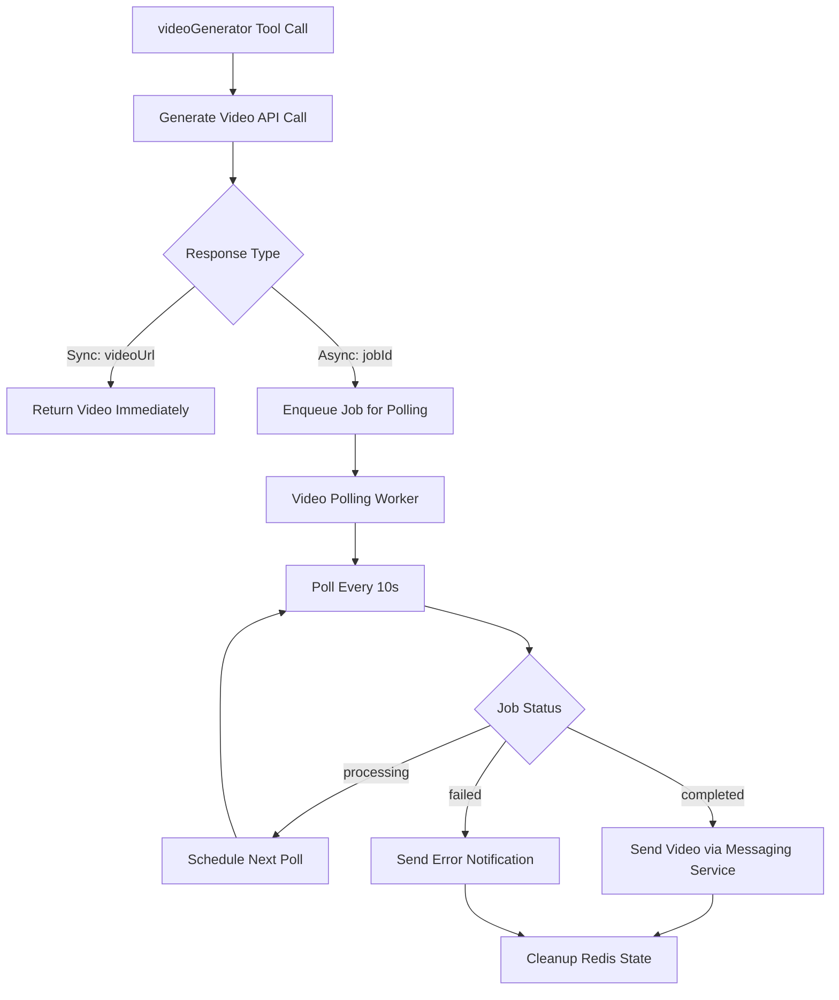

# 🎬 Video Polling System - Complete Implementation

## 📋 Overview

The Video Polling System handles async video generation jobs with Redis-based queue management, optimized for short-duration (1-2 minute) video processing workflows with automatic completion notifications via dual messaging services.

## 🏗️ Architecture

### **Video-Optimized Job Processing**
- **Short-Duration Focus**: Optimized for 1-2 minute video generation (vs 5-20min websites)
- **Frequent Polling**: 10-second intervals (vs 30-90s adaptive for websites)
- **Quick Timeout**: 5-minute maximum (vs 20min for websites)
- **Redis Persistence**: Survives server restarts with job state recovery

### **Dual Messaging Video Delivery**
- **UltraMsg Video Format**: Proper video message sending with caption
- **WhatsApp Factory**: Text notification with video link (video format support TBD)
- **Automatic Detection**: Uses same messaging service that initiated conversation

## 🔧 Components

### **1. videoPollingWorker.js**
**Purpose**: Background worker for continuous video job processing
- **Queue Processing**: Uses Redis `BRPOP` for efficient blocking queue operations
- **Job Recovery**: Scans Redis for pending video jobs after server restart
- **Distributed Locking**: Prevents concurrent processing across multiple instances
- **Timeout Management**: 5-minute maximum with automatic failure handling
- **Video Notifications**: Sends completed videos via appropriate messaging service

### **2. Video Job Redis Architecture**
```javascript
// Redis key patterns (optimized for 1-2min jobs)
video:job:${jobId}        // Job state (10min TTL)
video:poll:queue          // Persistent job queue
video:lock:${jobId}       // Distributed locks (1min TTL)
video:completed:${jobId}  // Audit trail (2hrs TTL)
video:attempts:${jobId}   // Retry counters (10min TTL)
```

### **3. Enhanced OpenAI Tool Integration**
**Purpose**: Automatic job enqueueing for async video processing
- **Async Detection**: Automatically enqueue when `mode: 'async'` and `jobId` present
- **Job Metadata**: Stores prompt, model, version, aspect ratio for debugging
- **Non-blocking**: Enqueueing failures don't affect tool response
- **Enhanced Response**: Includes `job_id`, `status_url`, and `polling_status` fields

### **4. Dual Messaging Integration**
**UltraMsg Video Format:**
```javascript
// UltraMsg video endpoint
POST https://api.ultramsg.com/{INSTANCE_ID}/messages/video

// Payload
{
  "token": "AGENT_TOKEN",
  "to": "PHONE_NUMBER", 
  "video": "VIDEO_URL",
  "caption": "🎥 ¡Tu video está listo! Se generó en 45 segundos.",
  "msgId": "" // Optional reply context
}
```

**WhatsApp Factory Format:**
```javascript
// Text message with video link (fallback)
"🎥 ¡Tu video está listo! Se generó en 45 segundos.\n\n🔗 Video: VIDEO_URL"
```

## 🚀 Video Polling Flow

### **Complete Async Workflow**


### **Timeline Example (Async Mode)**
```javascript
// T+0s: User requests video
{
  "prompt": "Video vertical para TikTok de persona bailando",
  "imageFileId": "abc123def456...",
  "aspectRatio": "9:16",
  "messageToUser": "Generando tu video vertical, tardará 1-2 minutos..."
}

// T+2s: Tool response  
{
  "success": true,
  "job_id": "job_1757157518747_grhexcfhk", 
  "status_url": "/job/job_1757157518747_grhexcfhk",
  "polling_status": "Job enqueued for background polling - you will receive the video when ready"
}

// T+5s: First poll starts
GET https://video.api-ai-mvp.com/job/job_1757157518747_grhexcfhk
→ {status: "processing"}

// T+15s, T+25s, T+35s...: Continue polling every 10s

// T+65s: Video completed
GET https://video.api-ai-mvp.com/job/job_1757157518747_grhexcfhk  
→ {status: "completed", videoUrl: "https://files.api-ai-mvp.com/file/..."}

// T+67s: User receives video notification
UltraMsg/WhatsApp: 🎥 Video sent with caption "¡Tu video está listo! Se generó en 65 segundos."
```

## ⚙️ Configuration & Performance

### **Video Worker Optimization**
```javascript
// Optimized for 1-2 minute video processing
POLLING_STRATEGY = {
  interval: 10000,        // 10s (vs 30-90s websites)
  timeout: 300000,        // 5min (vs 20min websites)
  maxAttempts: 30,        // Conservative limit
  initialDelay: 5000      // 5s delay before first poll
}

// Redis TTL optimized for short jobs
TTL = {
  videoJob: 600,          // 10min (generous for 1-2min jobs)
  pollLock: 60,           // 1min (prevent concurrent polling)
  completed: 7200,        // 2hrs (audit trail)
  attempts: 600           // 10min (retry tracking)
}
```

### **API Polling Configuration**
- **Endpoint**: `GET https://video.api-ai-mvp.com/job/{jobId}`
- **Authentication**: `X-API-Key` header required
- **Timeout**: 15-second HTTP timeout for polling requests
- **Retry Logic**: Exponential backoff (max 1 minute delay)

### **Error Handling**
```javascript
// Status response handling
{status: "processing"} → Continue polling ✅
{status: "completed"}  → Send video notification ✅  
{status: "failed"}     → Send error notification ❌
{status: "not_found"}  → Send expiration notification ❌
```

## 🔍 Monitoring & Debugging

### **Redis Monitoring Commands**
```bash
# Check video job queue length
redis-cli LLEN video:poll:queue

# Check active video jobs
redis-cli KEYS "video:job:*"

# Check video worker locks  
redis-cli KEYS "video:lock:*"

# Check completed video jobs
redis-cli KEYS "video:completed:*"
```

### **Video Worker Health Checks**
```javascript
// Monitor video worker status
const queueLength = await redisClient.lLen('video:poll:queue');
const activeJobs = await redisClient.keys('video:job:*');
const lockedJobs = await redisClient.keys('video:lock:*');

console.log(`Video Queue: ${queueLength}, Active: ${activeJobs.length}, Locked: ${lockedJobs.length}`);
```

### **Logging Pattern**
```javascript
🚀 Starting video polling worker: video_worker_123_abc45
🎬 Processing video job from queue: job_1757157518747_grhexcfhk
🔍 [job_123] Polling video status (attempt 3, elapsed: 35s)
✅ [job_123] Video generation completed
🎥 Video notification sent successfully for conversation: 68bb3c3585425ee98e9f4f12
```

## 📊 Performance Characteristics

### **Polling Efficiency** 
- **Fixed 10s intervals**: Predictable API usage for short video jobs
- **Quick completion detection**: Average video ready in 6-12 polls (60-120s)
- **Minimal resource usage**: Blocking Redis operations prevent unnecessary cycles
- **Concurrent safety**: Distributed locking prevents duplicate processing

### **Notification Delivery**
- **UltraMsg Videos**: Native video message with caption
- **WhatsApp Factory**: Text message with video link (expandable to native video)
- **Dual compatibility**: Works with both messaging services transparently
- **Error resilience**: Text fallback if video sending fails

## 🛡️ Error Scenarios & Recovery

### **Timeout Management**
```javascript
// 5-minute timeout with user notification
if (elapsed > 300000) { // 5 minutes
  await sendVideoFailureNotification(conversationId, 
    "Video generation timeout: Process exceeded 5 minutes");
  await cleanupVideoJobState(jobId);
}
```

### **API Failure Recovery**
```javascript
// Exponential backoff for temporary failures
const retryDelay = Math.min(5000 * Math.pow(2, attempts), 60000); // Max 1min
setTimeout(() => requeueVideoJob(jobId), retryDelay);
```

### **Job Recovery After Restart**
```javascript
// Automatic recovery of jobs within 5-minute window
const elapsed = Date.now() - job.startTime;
if (elapsed < 300000) {
  console.log('♻️ Recovering video job after restart');
  await redisClient.lPush(VIDEO_REDIS_KEYS.pollQueue, jobId);
}
```

## 🔗 Integration with AI Agents API

### **Automatic Job Enqueueing**
```javascript
// In openaiIntegration.js videoGenerator case
if (generationOptions.mode === 'async' && videoResult.jobId) {
  await enqueueVideoJob(videoResult.jobId, conversationId, jobMetadata);
  console.log('Video job enqueued for background polling');
}
```

### **Enhanced Tool Response**
```javascript
// Async mode response includes polling info
{
  "success": true,
  "job_id": "job_1757157518747_grhexcfhk",
  "status_url": "/job/job_1757157518747_grhexcfhk", 
  "polling_status": "Job enqueued for background polling - you will receive the video when ready",
  "processing_mode": "async",
  "video_url": null, // Will be sent via notification when ready
  "estimated_time": "1-2 minutes"
}
```

## 🎯 Production Readiness

✅ **Job Recovery** - Active jobs recovered after server restart  
✅ **Distributed Processing** - Multiple worker instances supported  
✅ **Error Resilience** - Comprehensive error handling and retry logic  
✅ **Timeout Management** - 5-minute maximum with user notification  
✅ **Dual Messaging** - Support for both UltraMsg and WhatsApp Factory  
✅ **Resource Cleanup** - Automatic cleanup of expired jobs and locks  
✅ **Monitoring** - Comprehensive logging and Redis health checks  
✅ **Video Format Support** - Native UltraMsg video messages with caption  
✅ **Graceful Shutdown** - Clean worker termination on server restart  

The video polling system is production-ready and optimized for 1-2 minute video generation workflows with enterprise-grade reliability and automatic user notifications.

## 🔧 Troubleshooting

### **Common Issues**

**Videos Not Delivered**
```bash
# Check video queue
redis-cli LLEN video:poll:queue

# Check active video jobs
redis-cli KEYS "video:job:*"

# Check completed videos
redis-cli KEYS "video:completed:*"
```

**Worker Not Processing**
```bash
# Restart video worker (logs will show)
# Video polling worker should appear in server startup logs
```

**API Polling Failures**
```javascript
// Check video API health
curl -H "X-API-Key: API_KEY" https://video.api-ai-mvp.com/health

// Manual job status check
curl -H "X-API-Key: API_KEY" https://video.api-ai-mvp.com/job/JOB_ID
```
